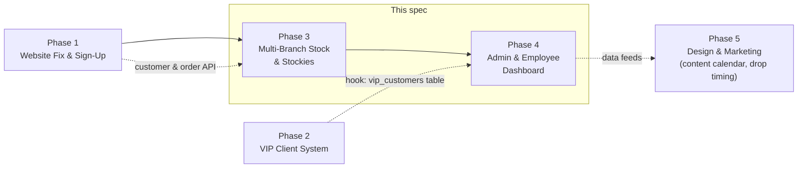

# Vision & Scope

## The job to be done

Chiefs of Angels is expanding from a single shop to multiple branches. Today,
knowing what stock is where, what staff should be doing, and which orders are
outstanding runs on **photos and WhatsApp** — per the project plan's own framing.
That doesn't scale past one till point.

This system replaces that with **one live, phone-native picture of the business**
that the Operations Manager can check from anywhere, and that every branch
contributes to and reads from throughout the day.

## Who uses it

| Role | What they need from it |
|---|---|
| **Operations Manager** | Every branch's stock, sales and staff at a glance; where to move stock and why; who's behind on their tasks; which orders are stuck; which branch is winning and which is struggling |
| **Branch Manager** | Their branch's stock and reorder needs; their team's task completion; incoming/outgoing transfers; their branch's orders |
| **Sales Associate** | Today's tasks; how to check if an item is in stock (at their branch or another one, for a customer); marking things done |
| **Stock Controller** *(central, optional role — can be the Ops Manager wearing a second hat)* | Approves and dispatches transfers; reconciles counts; manages the product catalogue |

## In scope (this spec)

- Multi-branch stock tracking, live counts, movement history — **Phase 3**
- Cross-branch stock visibility ("Stockies") and system-generated transfer
  suggestions — **Phase 3**
- Transfer request → approve → dispatch → receive workflow — **Phase 3**
- Central Ops Manager dashboard across all branches — **Phase 4**
- Task assignment (daily / weekly / event-based) and completion tracking — **Phase 4**
- Order tracking (in-store and online) through to fulfilment — **Phase 4**
- Alerts: low stock, overstock, high-demand spikes, overdue tasks, stuck orders
- Branch performance leaderboard (what sells where)
- Product catalogue seeded from the live storefront

## Explicitly out of scope here (owned by other phases, hooked not built)

- **Phase 1** — the public website itself, client sign-up/login on
  chiefsofangels.co.za. This system *consumes* that platform's customer and order
  data via API once Phase 1 ships (see
  [06-API-AND-INTEGRATIONS.md](06-API-AND-INTEGRATIONS.md)); it doesn't rebuild it.
- **Phase 2** — VIP tiering, early-access windows, new-drop email alerts to
  customers. The data model reserves a `vip_customers` table and the alerts engine
  reserves a `new_stock_live` event so Phase 2 can be wired in without a schema
  change, but the VIP rules/UI themselves are Phase 2's build.
- **Phase 5** — graphic design/social content. No overlap; unrelated system.
- Payments, POS till reconciliation, accounting/bookkeeping — integration points
  only, not built here (see API doc).

## How this fits the roadmap

Phase 3 and 4 are natural partners and are specified together here because a
transfer suggestion is meaningless without someone to action it, and a task board
is meaningless without the stock and order data driving the tasks in the first
place — they're one product, delivered as two build milestones (see
[09-BUILD-ROADMAP.md](09-BUILD-ROADMAP.md)).

## Success looks like

- An Ops Manager can answer "how much of X do we have, and where" in under 10
  seconds, from their phone, without calling a branch.
- A stock imbalance between branches gets caught and actioned by the system's own
  suggestion — not discovered three weeks later when a branch sells out.
- A Sales Associate always knows their day's tasks without asking a manager.
- No stock count, transfer or task lives in a WhatsApp thread anymore.
