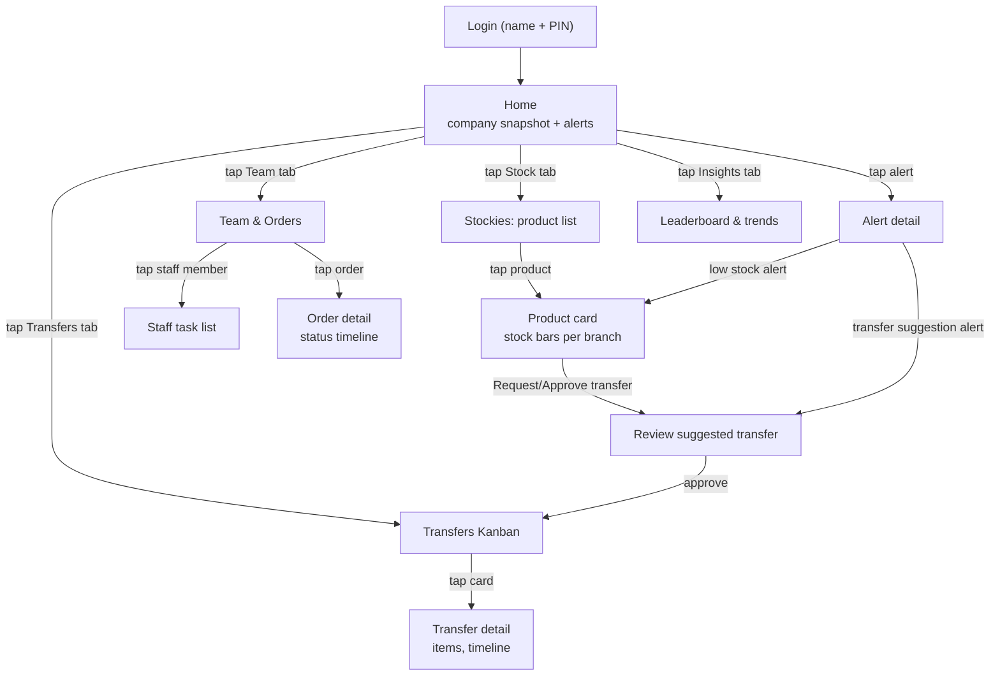

# Mobile Experience & Navigation

Phone-first, one thumb, designed there before anywhere else. Bottom tab bar for
destinations, a single floating action button (FAB) for the most common
in-the-moment action, and a slide-in branch switcher for the one role that needs to
see more than one branch. The same screens then adapt for tablet and PC — see
[Tablet & desktop](#tablet--desktop-same-app-more-room) below — because staff carry
phones and tablets on the floor, but the Operations Manager also needs a clear,
un-cramped view from a back-office or home PC.

## The app reshapes per role — three different apps, one codebase

### Sales Associate — 3 tabs (shop-floor speed)

```
┌─────────────────────────────┐
│  9:41           🔔 2         │  ← header: today's date, alert badge
│                               │
│   MY DAY                     │
│   ─────────────────────      │
│   ☐ Restock front table      │
│   ☐ Count NY Caps shelf      │
│   ✓ Open till float           │
│                               │
│   ORDERS FOR PICKUP TODAY    │
│   ─────────────────────      │
│   #1042  Thandi M.  Ready    │
│                               │
├───────────────────────────────┤
│   [Home]   [Stock]   [Tasks]  │  ← bottom tab bar, 3 items
│                          (＋)  │  ← FAB: Scan / Quick count
└───────────────────────────────┘
```
- **Home** — their branch's snapshot + today's tasks + today's pickups, nothing else.
- **Stock** — search/scan any product, see stock at *their* branch large and clear,
  with a smaller "also at: Sandton (4), Durban (0)" line for customer questions —
  read-only cross-branch visibility, no other branch's controls.
- **Tasks** — full list of their assigned tasks, swipe right to complete.
- **FAB** — camera icon: scan a barcode to jump straight to that product's stock
  card, or hold to start a quick recount.

### Branch Manager — 4 tabs (their branch, full control)

```
[Home] [Stock] [Transfers] [Team & Orders]        (＋) FAB: New task / Request transfer
```
- **Home** — branch snapshot (today's sales, open alerts, task completion %),
  incoming transfer notifications.
- **Stock** — full stock list for their branch, tap into any item for movement
  history, adjust counts, see cross-branch levels, **request a transfer in**.
- **Transfers** — Kanban strip (Suggested → Requested → Approved → In Transit →
  Received) filtered to transfers touching their branch; approve/receive with a tap.
- **Team & Orders** — assign/reassign tasks to their staff, see completion status;
  order queue for their branch.

### Operations Manager — 5 tabs + branch switcher (whole business)

```
┌─────────────────────────────┐
│  ▾ All Branches      🔔 7    │  ← branch switcher pill, always visible
│                               │
│   TODAY, ACROSS 3 BRANCHES   │
│   R 42,300 sales · 61 units  │
│                               │
│   🔴 3 low-stock alerts       │
│   🟡 2 transfer suggestions   │
│   🟠 1 task overdue           │
│                               │
│   BRANCH LEADERBOARD (wk)    │
│   1. Sandton    R 118,400     │
│   2. Cape Town  R  94,200     │
│   3. Durban     R  61,900     │
├───────────────────────────────┤
│ [Home][Stock][Transfers][Team][Insights]   (＋) │
└───────────────────────────────┘
```
- **Home** — company-wide snapshot, unified alert feed, branch leaderboard preview.
  Tapping the branch-switcher pill filters *every* tab to one branch, or back to
  "All Branches."
- **Stock ("Stockies")** — every product, every branch, side-by-side stock bars per
  item; the cross-branch view Sales Associates only get a sliver of. See
  [03-CORE-FEATURES.md](03-CORE-FEATURES.md).
- **Transfers** — full Kanban across all branches, plus the system's suggested
  transfers waiting for a decision.
- **Team & Orders** — every branch's task boards and order queues, staff directory,
  create/reassign anything anywhere.
- **Insights** — leaderboard (daily/weekly/monthly, by revenue or units), sell-
  through and days-of-stock by branch, staff task-completion rates, full alert
  history/log.
- **FAB** — context-aware: new task, new product, or trigger a manual stock count
  request to a branch.

## Screen-to-screen flow (Ops Manager, representative path)



## Tablet & desktop — same app, more room

Three breakpoints, one codebase, the same components — never a second "desktop
build" with different information architecture:

| | Phone (< 640px) | Tablet (640–1024px) | PC / wide (> 1024px) |
|---|---|---|---|
| **Navigation** | Bottom tab bar + FAB | Bottom tab bar still (thumb-reachable on a handheld tablet) | Slim left icon-rail — icon + label, 3–5 items, collapsible; the branch switcher pill moves to the top of the rail |
| **Content columns** | 1 (single card stream) | 2 | 2–3, content-driven (grid fills available width, never stretches a lone card full-bleed) |
| **Stat tiles** | Stacked full-width | 2 per row | Row of 3–4, sized to content |
| **Stockies product cards** | 1 per row, per-branch bars horizontal | 2 per row | Grid of 3, so an Ops Manager scans the whole catalogue's cross-branch picture without endless scrolling |
| **Transfers Kanban** | Horizontal-scroll strip, ~1.5 columns visible | 3 columns visible | All 5 status columns visible at once, no scrolling — this is the one screen where PC's extra width earns its keep most directly |
| **Alerts / leaderboard** | Single list | Single list, wider cards | Two-panel: alerts feed left, leaderboard/insights right — still cards, still the same visual language, just laid out side by side |
| **Typography & touch targets** | Large, thumb-sized | Same | Slightly denser, but never mouse-only — a PC user can still tap-sized-click everything; nothing requires hover to discover |

What does **not** change with width: the card-based components, the colour/status
language, the role-scoped nav items themselves, and the "alerts pushed to Home"
principle. A PC user gets a roomier, clearer arrangement of the same app — not
Bolide WMS's dense sidebar-and-sortable-table dashboard back-doored in through a
breakpoint.

## Interaction conventions (apply everywhere)

- **Tap targets ≥ 44×44px**, no nested horizontal scroll, no hover-only affordances.
- **Colour + icon before text** for status (🔴 critical, 🟠 warning, 🟡 suggestion,
  🟢 healthy) — legible at a glance, in a bright shop or a dim stockroom.
- **Swipe actions** on list rows: swipe a task right to complete, swipe a transfer
  card to advance its status.
- **Stepper controls** (– qty +) for any count entry, never a bare numeric keyboard
  unless typing a larger correction.
- **Offline-tolerant**: actions taken with no signal queue locally and sync with a
  visible "3 changes pending sync" indicator — never silently lost, never blocking.
- **Confirmation is one tap**, not a modal with a paragraph — "Mark received ✓"
  directly on the card.
