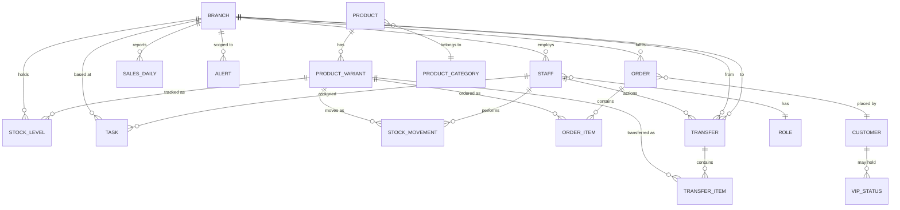

# Data Model

This system owns **its own relational database** from day one — it does not read a
regenerated JSON fixture the way Bolide WMS's demo does. Schema below is written
Postgres-flavoured (works identically on MySQL/SQLite with minor type swaps) and is
deliberately normalised so future API consumers (the storefront, a POS, accounting)
each get a clean, stable surface rather than reshaping raw tables.

## Entity relationship diagram

## Tables

### `branch`
| column | type | notes |
|---|---|---|
| id | uuid pk | |
| name | text | e.g. "Sandton City" |
| code | text unique | short code, e.g. `SAN` |
| type | enum | `retail`, `warehouse`, `online_dc` — the online store's fulfilment stock is just another branch here |
| city | text | |
| address | text | |
| phone | text | |
| opened_at | date | |
| active | boolean | |

### `role`
| column | type | notes |
|---|---|---|
| id | uuid pk | |
| name | enum | `ops_manager`, `branch_manager`, `sales_associate`, `stock_controller` |
| scope | enum | `all_branches` or `own_branch` — drives what the app shows, per [02-MOBILE-EXPERIENCE.md](02-MOBILE-EXPERIENCE.md) |

### `staff`
| column | type | notes |
|---|---|---|
| id | uuid pk | |
| name | text | |
| role_id | fk → role | |
| branch_id | fk → branch, nullable | null for `ops_manager` (all-branch scope) |
| phone | text | |
| email | text | |
| pin_hash | text | short-PIN login, shared shop devices |
| active | boolean | |
| started_at | date | |

### `product_category`
| column | type |
|---|---|
| id | uuid pk |
| name | text — Loungewear, Outerwear, Denim, Accessories, Skirts |

### `product`
| column | type | notes |
|---|---|---|
| id | uuid pk | |
| sku | text unique | see [07-PRODUCT-CATALOG.md](07-PRODUCT-CATALOG.md) for scheme |
| name | text | |
| category_id | fk → product_category | |
| collection | text nullable | e.g. "Rock Stars Never Die", "Noah" — for merchandising/reporting groupings |
| description | text | |
| base_price_cents | integer | ZAR, stored as cents to avoid float errors |
| sale_price_cents | integer nullable | |
| woocommerce_id | text nullable | external id once storefront sync is live |
| active | boolean | |

### `product_variant`
| column | type | notes |
|---|---|---|
| id | uuid pk | |
| product_id | fk → product | |
| size | text nullable | not all products have sizes (e.g. caps) |
| color | text nullable | |
| variant_sku | text unique | |
| barcode | text nullable | for scan-to-find |

### `stock_level`
| column | type | notes |
|---|---|---|
| id | uuid pk | |
| variant_id | fk → product_variant | |
| branch_id | fk → branch | |
| qty_on_hand | integer | |
| qty_reserved | integer | held against open orders, not available to sell/transfer |
| reorder_point | integer | see [04-ALERTS-AND-INTELLIGENCE.md](04-ALERTS-AND-INTELLIGENCE.md) |
| par_level | integer | |
| last_counted_at | timestamp | |
| **unique** | | `(variant_id, branch_id)` |

### `stock_movement`
| column | type | notes |
|---|---|---|
| id | uuid pk | |
| variant_id | fk → product_variant | |
| branch_id | fk → branch | |
| type | enum | `receive`, `sale`, `transfer_out`, `transfer_in`, `count_adjustment`, `return`, `damage` |
| qty_delta | integer | signed |
| reference_type | text nullable | `order`, `transfer`, `manual` |
| reference_id | uuid nullable | |
| performed_by | fk → staff | |
| note | text nullable | |
| created_at | timestamp | |

### `transfer`
| column | type | notes |
|---|---|---|
| id | uuid pk | |
| transfer_number | text unique | human-readable, e.g. `TR-2026-0142` |
| from_branch_id | fk → branch | |
| to_branch_id | fk → branch | |
| status | enum | `suggested`, `requested`, `approved`, `in_transit`, `received`, `cancelled` |
| reason | text nullable | system-generated explanation for suggestions (see alerts doc) |
| requested_by | fk → staff, nullable | null if system-suggested and not yet accepted |
| approved_by | fk → staff, nullable | |
| created_at | timestamp | |
| dispatched_at | timestamp nullable | |
| received_at | timestamp nullable | |

### `transfer_item`
| column | type |
|---|---|
| id | uuid pk |
| transfer_id | fk → transfer |
| variant_id | fk → product_variant |
| qty_requested | integer |
| qty_sent | integer nullable |
| qty_received | integer nullable |

### `customer`
| column | type | notes |
|---|---|---|
| id | uuid pk | |
| name | text | |
| email | text | |
| phone | text nullable | |
| woocommerce_id | text nullable | synced once Phase 1/2 ship |

### `vip_status` *(Phase 2 hook — reserved, not built here)*
| column | type |
|---|---|
| id | uuid pk |
| customer_id | fk → customer |
| tier | text |
| qualified_at | date |
| qualified_by | enum (`spend_threshold`, `manual_tag`) |

### `order`
| column | type | notes |
|---|---|---|
| id | uuid pk | |
| order_number | text unique | |
| source | enum | `online`, `in_store` |
| branch_id | fk → branch | fulfilling branch |
| customer_id | fk → customer, nullable | |
| status | enum | `new`, `packed`, `ready`, `fulfilled`, `cancelled` |
| assigned_to | fk → staff, nullable | |
| created_at | timestamp | |
| due_at | timestamp nullable | SLA target |
| fulfilled_at | timestamp nullable | |

### `order_item`
| column | type |
|---|---|
| id | uuid pk |
| order_id | fk → order |
| variant_id | fk → product_variant |
| qty | integer |
| price_cents | integer |

### `task`
| column | type | notes |
|---|---|---|
| id | uuid pk | |
| title | text | |
| description | text nullable | |
| type | enum | `daily`, `weekly`, `event` |
| branch_id | fk → branch | |
| assigned_to | fk → staff, nullable | nullable = assigned to a role/whole branch |
| assigned_role | fk → role, nullable | e.g. "every Sales Associate at this branch" |
| priority | enum | `low`, `normal`, `high` |
| status | enum | `pending`, `in_progress`, `done`, `overdue` |
| due_at | timestamp | |
| created_by | fk → staff | |
| completed_at | timestamp nullable | |

### `sales_daily` *(materialised rollup, rebuilt nightly or streamed)*
| column | type | notes |
|---|---|---|
| id | uuid pk | |
| branch_id | fk → branch | |
| product_id | fk → product | |
| date | date | |
| units_sold | integer | |
| revenue_cents | integer | |

Feeds [03-CORE-FEATURES.md](03-CORE-FEATURES.md)'s leaderboard and the transfer
suggestion algorithm's velocity calculations without recomputing from raw
`stock_movement` rows on every request.

### `alert`
| column | type | notes |
|---|---|---|
| id | uuid pk | |
| type | enum | see [04-ALERTS-AND-INTELLIGENCE.md](04-ALERTS-AND-INTELLIGENCE.md) |
| severity | enum | `critical`, `warning`, `suggestion`, `info` |
| branch_id | fk → branch, nullable | |
| variant_id | fk → product_variant, nullable | |
| related_type | text nullable | `transfer`, `task`, `order` |
| related_id | uuid nullable | |
| message | text | plain-language, pre-rendered |
| status | enum | `open`, `acknowledged`, `resolved` |
| created_at | timestamp | |
| resolved_at | timestamp nullable | |

### `audit_log`
| column | type | notes |
|---|---|---|
| id | uuid pk | |
| actor_id | fk → staff | |
| action | text | e.g. `stock.adjust`, `transfer.approve`, `task.complete` |
| entity_type | text | |
| entity_id | uuid | |
| created_at | timestamp | |

Every state-changing action in the app writes here — this is what makes "who
counted this" or "who approved that transfer" answerable months later, and is a
prerequisite for any future integration that needs to trust this system's numbers.

## Design notes for future scale

- **Multi-branch and multi-currency-ready**: `branch` is a first-class table from
  day one, not bolted on later — this was true even for the single current shop, so
  adding branch #2 is a row insert, not a migration.
- **Money as integer cents**, never float, everywhere.
- **Soft state, hard history**: current state lives on `stock_level`/`transfer`/
  `task`/`order`, but every transition is also an immutable row in `stock_movement`/
  `audit_log` — current-state tables can be rebuilt from history if ever needed.
- **External ids reserved now** (`woocommerce_id` on `product` and `customer`) so
  the Phase 1/2 sync described in
  [06-API-AND-INTEGRATIONS.md](06-API-AND-INTEGRATIONS.md) is additive, not a
  schema rewrite.
